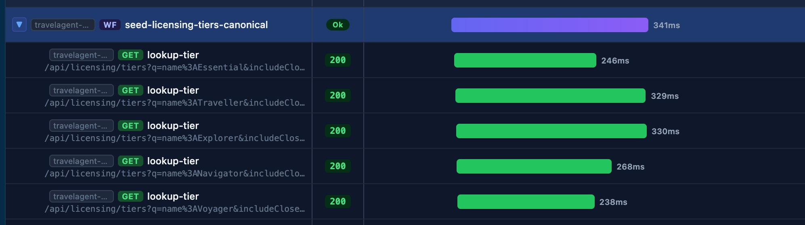

# Execution Reporting

SphereIntegrationHub can persist each workflow run as local execution artifacts for post-run diagnostics, auditability, and sharing.

## What you get

- JSON report for machine-readable inspection and automation.
- Self-contained HTML report for human investigation.
- Console summary with execution id and generated artifact paths.
- Configurable HTTP capture: `none`, `headers`, or `bodies`.
- Redaction by default for sensitive headers and JSON fields.
- Secret masking for workflow inputs, init-stage variables, and specific stage/workflow outputs.

## Generated artifacts

When reporting is enabled, SIH writes one or both of:

- `{workflow-name}.{executionId}.workflow.report.json`
- `{workflow-name}.{executionId}.workflow.report.html`

When workflow output persistence is enabled, SIH also writes:

- `{workflow-name}.{executionId}.workflow.output`

## Interactive HTML viewer

The generated HTML report is fully self-contained and focused on execution analysis.

It includes:

- Timeline overview of nested workflows and stage durations.
- Status and metrics summary for executed, skipped, failed, mocked, and retried stages.
- Stage detail panel with workflow result, resolved inputs, execution timing, assertions, and HTTP metadata.
- Execution switcher when multiple report artifacts exist in the same output folder.

### Timeline overview


### Parallel execution

When a workflow uses `forEach` with parallel execution, the timeline renders concurrent stages as overlapping bars, making it easy to see how many branches ran simultaneously and whether any branch was a bottleneck.



### Execution switcher


### Stage details


## CLI usage

Generate JSON + HTML reports during execution:

```bash
sih \
  --workflow ./src/resources/workflows/create-account.workflow \
  --env pre \
  --report-format both \
  --capture-http bodies
```

Generate an interactive HTML report from an existing JSON artifact:

```bash
sih report ./output/create-account.01J....workflow.report.json
```

Generate without opening the browser:

```bash
sih report ./output/create-account.01J....workflow.report.json \
  --output ./reports \
  --no-open
```

## Regression snapshots

Snapshots turn a known-good execution report into a versionable baseline for regression testing.

Create a snapshot from a report:

```bash
sih snapshot create \
  ./output/create-account.01J....workflow.report.json \
  --name happy-path
```

Compare a later report against that snapshot:

```bash
sih snapshot compare \
  ./output/create-account.01K....workflow.report.json \
  --snapshot ./snapshots/create-account.happy-path.workflow.snapshot.json
```

The snapshot baseline intentionally ignores volatile run metadata such as execution id, timestamps, durations, report file paths, and tool version. It keeps stable regression signals: workflow identity, environment, inputs, final result, output, stage statuses, stage outputs, assertion diagnostics, selected metrics, and preflight outcome metadata.

On mismatch, the command exits with `1` and prints JSON-path-like differences such as `$.output.customerId`.

The interactive report viewer loads snapshots automatically from:

- the same directory as the report JSON files;
- a sibling `snapshots/` directory next to the report output directory;
- the `api.catalog` `baselineSnapshot` path;
- an explicit `--snapshot <snapshot-json-or-dir>` argument.

Example:

```bash
sih report ./output \
  --catalog ./api.catalog \
  --snapshot ./snapshots \
  --no-open
```

`baselineSnapshot` is a catalog-level convention for the repository baseline. Because `api.catalog` is currently a list of catalog versions, define it on the matching workflow version when that matters, or on one catalog entry as the repository default. SIH first looks for a `baselineSnapshot` on the report workflow version; if none exists, it uses the first `baselineSnapshot` defined in the catalog. The path is resolved relative to the `api.catalog` file unless it is absolute:

```yaml
- version: "1.0"
  baselineSnapshot: ./snapshots/create-account.happy-path.workflow.snapshot.json
  definitions: []
```

When at least one snapshot is available, the viewer shows a baseline selector and a `Compare` switch enabled by default. The selected baseline is rendered as a ghost timeline layer behind the current execution, and stage details include baseline-vs-current differences. The `Baseline` button can load a snapshot JSON from any local location as a temporary UI override.

## Reporting configuration

Place reporting defaults in `workflows.config` next to the workflow:

```yaml
reporting:
  enabled: true
  format: "json"
  captureHttp: "headers"
  redactSensitiveData: true
  summaryConsole: true
```

Rules:

- CLI flags override `workflows.config`.
- `format: "none"` or `--report-format none` disables report files.
- `captureHttp: "headers"` stores redacted headers and metadata without persisting bodies.
- `captureHttp: "bodies"` additionally stores request/response bodies, still redacted unless `--no-redact` is used.

## Assertion diagnostics

Execution reports include assertion diagnostics when a workflow uses `assertions`.

JSON report fields:

- `Assertions`: flat list of every evaluated assertion.
- `Stages[].Assertions`: assertions attached to that stage.
- `Metrics.TotalAssertions`
- `Metrics.PassedAssertions`
- `Metrics.FailedAssertions`
- `Metrics.WarningAssertions`

Each assertion record includes:

- `Scope`: `Stage` or `EndStage`.
- `WorkflowName` and optional `StageName`.
- `Name`, `Status`, `Operator`, `Expression`, `Expected`, and `Actual`.
- `Blocking`: whether a failure should fail the workflow.
- `WarningMessage`: populated when a failed assertion is non-blocking.

The HTML report shows assertion counts in the metrics chips and lists stage assertions in the stage detail panel. Non-blocking failures are shown as failed assertions with `non-blocking` and a warning message.

Assertion failure blocking precedence:

1. `assertions[].blocking`
2. CLI `--assertion-failures-block <true|false>`
3. selected `api.catalog` version `assertionFailuresBlock`
4. default `true`

## Secret masking

Secret masking is independent of the `--no-redact` flag. It is always active for values explicitly declared as secret in the workflow definition.

### How to mark secrets

**Inputs** — set `secret: true` on an `input` entry:

```yaml
input:
  - name: "apiKey"
    type: "Text"
    secret: true
```

Effect: the value is shown as `*****` in `report.Inputs` and suppressed from stage outputs.

**Init-stage variables** — set `secret: true` on a `initStage.variables` entry:

```yaml
initStage:
  variables:
    - name: "nonce"
      type: "Guid"
      secret: true
```

Effect: the generated value is registered in the runtime secret register. Any stage or workflow output whose resolved value equals the secret value is masked as `*****`.

**Stage outputs** — list keys in `secretOutputs` on a stage:

```yaml
output:
  accessToken: "{{stage:json(auth.output.body).token}}"
secretOutputs:
  - accessToken
```

Effect: the `accessToken` output key shows `*****` in `report.Stages[*].Output`.

**Workflow outputs** — list keys in `secretOutputs` on `endStage`:

```yaml
endStage:
  output:
    accessToken: "{{stage:auth.output.accessToken}}"
  secretOutputs:
    - accessToken
```

Effect: the `accessToken` key shows `*****` in `report.Output`.

### What is always visible

The key (name) is never masked — only the value. This ensures the report remains navigable for debugging while protecting sensitive data.

## Relationship to OpenTelemetry

Execution reports and OpenTelemetry are complementary:

- Execution reports are local per-run artifacts for investigation, CI artifacts, and audit trails.
- OpenTelemetry is for centralized tracing, dashboards, correlation, and alerts.

See [`.doc/telemetry.md`](./telemetry.md) for the telemetry model and [`.doc/cli.md`](./cli.md) for the full CLI flag reference.
