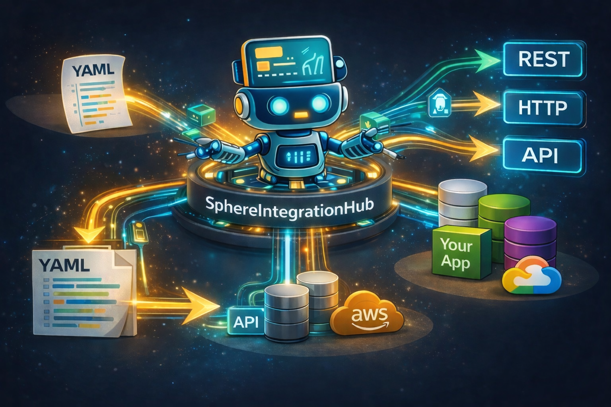

# SphereIntegrationHub

<p align="center">
  <a href="https://github.com/PinedaTec-EU/SphereIntegrationHub">
    
  </a>
</p>

[](https://deepwiki.com/PinedaTec-EU/SphereIntegrationHub)

[](https://opensource.org/licenses/MIT)
[](https://dotnet.microsoft.com/en-us/download/dotnet/10.0)

CLI tool to orchestrate API calls using versioned Swagger catalogs and YAML workflows. Workflows can reference other workflows, share context (like JWTs), validate endpoints against cached Swagger specs, and run in dry-run mode for validation.

Documentation:

- [`Overview`](.doc/overview.md)
- [`Why SphereIntegrationHub`](.doc/why-sih.md)
- [`workflow schema`](.doc/workflow-schema.md)
- [`swagger catalog`](.doc/swagger-catalog.md)
- [`cli help`](.doc/cli.md)
- [`variables and context`](.doc/variables.md)
- [`dry-run validation`](.doc/dry-run.md)
- [`open telemetry`](.doc/telemetry.md)
- [`MCP Server`](.doc/mcp-server.md) - 🚧 AI-assisted workflow creation (in development)
- [`plugins`](.doc/plugins.md)

## Community

If you use SphereIntegrationHub in your company or project, we'd love to hear about it!

- Give us a ⭐ on GitHub — it helps the project grow
- Share your experience on [LinkedIn](https://www.linkedin.com/in/jmrpineda) mentioning **#SphereIntegrationHub** — we repost and feature use cases
- Drop us a line at [sih@pinedatec.eu](mailto:sih@pinedatec.eu) — tell us what you're automating, we'd love to feature it

## Catalog

The API catalog is a fixed JSON file with versions, environment base URLs, and optional per-definition overrides such as `healthCheck`:

`src/resources/api-catalog.json`

Swagger definitions are cached per version in:

`src/resources/cache/{version}/{definition}.json`

If a definition includes `healthCheck`, the CLI performs an HTTP precheck before swagger caching and workflow execution, reports any failures, and continues.

## Workflow overview

Workflows are YAML files with main sections:

- `version`, `id`, `name`, `description`
- `references` for workflows and API definitions
- `input` for required variables
- `initStage` for workflow-specific variables or context defaults
- `stages` (endpoint/workflow calls)
- `endStage` for workflow output and context updates

Templates support `{{env:NAME}}` to read environment variables anywhere values are resolved.
Use `references.environmentFile` (or CLI `--envfile`) to load a `.env` file for those variables.
Inputs from `.wfvars` can be scoped by environment and version (see `variables and context`).
Stages can declare `delaySeconds` (0-60) to delay execution. Retry and circuit breaker settings apply only to `Endpoint` stages.
Structured JSON is now first-class: workflows can consume `Object` and `Array` inputs, address JSON paths in tokens, load request bodies from `bodyFile`, load collections from `dataFile`, iterate with `forEach`, and declare idempotent intent with `ensure`.
Execution reporting is also first-class: runs can emit JSON and HTML reports with stage timelines, retries, jumps, HTTP summaries, redacted payload capture, and a console summary for post-run diagnostics.

## Token and Workflow Semantics

Agents generating workflows should assume these runtime rules:

- `{{response.status}}`, `{{response.body}}`, and `{{response.headers.HeaderName}}` are supported for endpoint stages.
- `{{response.body.some.path}}` and `{{response.some.path}}` are valid when the response body is JSON.
- Optional path segments use a `?` suffix on the segment itself, for example `{{response.body.account.status?}}` or `{{stage:create.output.items.0.id?}}`. Missing optional segments resolve to empty output instead of failing.
- `runIf` supports compound expressions with `&&`, `||`, `!`, parentheses, safe comparisons against missing tokens, and helpers such as `exists(...)`, `empty(...)`, `coalesce(...)`, `first(...)`, `any(...)`, `jsonLength(...)`, and `isEmptyJson(...)`.
- Workflow validation can check response token paths against endpoint mock payloads when `stage.mock.payload` or `stage.mock.payloadFile` is present.
- `kind: Workflow` stage failures propagate to the parent workflow; parent execution does not continue past a failed child workflow.
- `forEach` on workflow stages aggregates both outputs and result state. In addition to `foreach_count` and `foreach_items`, workflow stages expose `foreach_results`, `foreach_success_count`, and `foreach_failed_count`.
- `response.*` tokens are endpoint-stage only. Workflow stages should use `stage:<name>.workflow.output.*` and `stage:<name>.workflow.result.{status,message}` instead.

## Execution reporting

The CLI can persist post-run diagnostics as execution artifacts. This is part of the runtime now, not a planned feature.

- JSON report: machine-readable execution timeline and outputs
- HTML report: human-readable execution summary
- Console summary: execution id plus generated artifact paths
- Configurable HTTP capture: `none`, `headers`, or `bodies`
- Redaction by default for sensitive headers and JSON fields

Use [`.doc/cli.md`](.doc/cli.md) for flags and [`.doc/telemetry.md`](.doc/telemetry.md) for the relationship between local reports and OpenTelemetry.

### Example workflow (login)

```yaml
version: "3.10"
id: "01J7Z6J1KQZV8Y6J9G4E2ZB6QH"
name: "login"
description: "Login workflow that returns a JWT."
output: false
references:
  apis:
    - name: "example-service"
      definition: "example-service"
input:
  - name: "username"
    type: "Text"
    required: true
  - name: "password"
    type: "Text"
    required: true
stages:
  - name: "login"
    kind: "Endpoint"
    apiRef: "example-service"
    endpoint: "/api/auth/login"
    httpVerb: "POST"
    expectedStatus: 200
    headers:
      Content-Type: "application/json"
    body: |
      {
        "user": "{{input.username}}",
        "password": "{{input.password}}"
      }
    output:
      jwt: "{{response.jwt}}"
endStage:
  context:
    tokenId: "{{stage:login.output.jwt}}"
```

### Example workflow (idempotent bootstrap with files and foreach)

```yaml
version: "3.11"
id: "01JBOOTSTRAPEXAMPLE0000000001"
name: "bootstrap-accounts"
description: "Creates accounts idempotently from a seed file."
output: true
references:
  apis:
    - name: "accounts"
      definition: "accounts"
input:
  - name: "seed"
    type: "Array"
    required: true
stages:
  - name: "create-account"
    kind: "Endpoint"
    apiRef: "accounts"
    endpoint: "/api/accounts"
    httpVerb: "POST"
    expectedStatus: 201
    forEach: "{{input.seed}}"
    itemName: "item"
    bodyFile: "./payloads/create-account.json"
    ensure:
      mode: "CreateIfMissing"
      jumpTo: "load-existing"
      output:
        exists: "true"
  - name: "load-existing"
    kind: "Endpoint"
    apiRef: "accounts"
    endpoint: "/api/accounts/{{context:item.id}}"
    httpVerb: "GET"
    expectedStatus: 200
endStage:
  output:
    created: "{{stage:create-account.output.foreach_items}}"
```

Example `./payloads/create-account.json`:

```json
{
  "id": "{{context:item.id}}",
  "name": "{{context:item.name}}"
}
```

## Sample Workflows

The repository includes reference workflows under `samples/`:

- `sample-parent.workflow` and `sample-child.workflow`: parent/child composition, workflow outputs/results, retries, circuit breakers, and conditional follow-up stages.
- `sample-conditional.workflow`: compound `runIf` with `&&`, `||`, parentheses, safe missing-token checks, optional JSON paths, `empty(...)`, and `coalesce(...)`.
- `sample-bootstrap.workflow`: `expectedStatuses`, `onStatus`, `ensure`, `bodyFile`, `dataFile`, and `forEach` for seed/bootstrap scenarios.
- `sample-parent.wfvars`: companion input example for the parent/child sample.
- `payloads/bootstrap-account.json` and `seed/accounts.json`: file-backed request and collection samples used by `sample-bootstrap.workflow`.

Use these files directly when authoring new workflows or when prompting MCP-based generation.

## Usage

Dry-run (validates workflow, references, and swagger paths without calling endpoints):

```bash
SphereIntegrationHub.cli \
  --workflow ./src/resources/workflows/create-account.workflow \
  --env pre \
  --dry-run \
  --verbose
```

Run with mocks (uses `stage.mock` when defined):

```bash
SphereIntegrationHub.cli \
  --workflow ./src/resources/workflows/create-account.workflow \
  --env pre \
  --mocked
```

Override root `.env` for `{{env:NAME}}` tokens:

```bash
SphereIntegrationHub.cli \
  --workflow ./src/resources/workflows/create-account.workflow \
  --env pre \
  --envfile ./workflows/.env
```

Force refresh of swagger cache:

```bash
SphereIntegrationHub.cli \
  --workflow ./src/resources/workflows/create-account.workflow \
  --env pre \
  --refresh-cache
```

Execute a workflow:

```bash
SphereIntegrationHub.cli \
  --workflow ./src/resources/workflows/create-account.workflow \
  --env pre \
  --input username=user \
  --input password=secret \
  --input accountName=Acme
```

Generate full execution artifacts:

```bash
SphereIntegrationHub.cli \
  --workflow ./src/resources/workflows/create-account.workflow \
  --env pre \
  --report-format both \
  --capture-http bodies
```

This writes:

- `{name}.{executionId}.workflow.output`
- `{name}.{executionId}.workflow.report.json`
- `{name}.{executionId}.workflow.report.html`

Reports include stage timings, retries, jumps, ensure status, HTTP status, redacted headers/body capture, and final outputs.

Override root `.env` for `{{env:NAME}}` tokens:

```bash
SphereIntegrationHub.cli \
  --workflow ./src/resources/workflows/create-account.workflow \
  --env pre \
  --envfile ./workflows/.env
```

### Key Advantages of SphereIntegrationHub

#### 🎯 1. Modular Workflow Composition

Unlike Postman's monolithic collections, workflows can reference other workflows as reusable modules:

```yaml
references:
  workflows:
    - name: "login"
      path: "./login.workflow"
stages:
  - name: "authenticate"
    kind: "Workflow"
    workflowRef: "login"  # Reuse login workflow
```

#### 🛡️ 2. Contract-First Validation

Validate endpoints against cached Swagger specifications **before execution**:

```bash
--dry-run --verbose  # Validates without making HTTP calls
```

This catches endpoint mismatches, missing parameters, and schema violations at validation time, not runtime.

#### 📦 3. GitOps-Ready Workflows

YAML workflows are human-readable and Git-friendly. Pull requests show exact changes:

```diff
+ - name: "create-org"
+   kind: "Endpoint"
+   apiRef: "accounts"
+   endpoint: "/api/organizations"
```

Compare this to Postman's JSON exports with GUIDs and nested structures.

#### 🔄 4. Context Propagation

Seamlessly pass JWTs, IDs, and data between workflow stages and nested workflows:

```yaml
endStage:
  context:
    tokenId: "{{stage:login.output.jwt}}"
    orgId: "{{stage:create-org.output.id}}"
```

No scripting required—context flows declaratively.

#### 🎲 5. Dynamic Value Service

Generate random values with built-in formatting:

```yaml
variables:
  - name: "accountId"
    type: "Random"
    randomType: "Guid"
  - name: "timestamp"
    type: "Random"
    randomType: "DateTime"
```

#### 🔍 6. Multi-Version API Catalog

Manage multiple API versions and environments in a single catalog:

```json
{
  "version": "3.11",
  "baseUrl": {
    "dev": "https://dev.api.com",
    "pre": "https://pre.api.com",
    "prod": "https://api.com"
  },
  "definitions": [
    {
      "name": "example-service",
      "swaggerUrl": "/example/swagger/v1.0/swagger.json",
      "basePath": "/ocapi"
    }
  ]
}
```

Swagger definitions are cached per version, ensuring validation against the correct contract.

#### 🚀 7. CI/CD Native

No conversion needed—workflows execute directly in pipelines:

```bash
SphereIntegrationHub.cli \
  --workflow ./workflows/smoke-test.workflow \
  --env prod \
  --dry-run  # Gate deployments with validation
```

#### 💾 8. Offline-First & Cloud-Free

No account required. No cloud dependency. No internet connection needed for execution:

- **All-in-one-place**: Workflows, catalogs, and Swagger cache live on disk
- **No vendor lock-in**: No subscription, no API limits
- **Optional telemetry**: OpenTelemetry is supported but disabled by default
- **Edit anywhere**: YAML files editable with any text editor (VS Code, vim, nano)
- **Complete privacy**: Your API workflows never leave your infrastructure
- **Zero latency**: No cloud round-trips—everything runs locally

Unlike Postman (cloud sync required) or Apidog (account-based), SphereIntegrationHub shares Bruno's philosophy of local-first tooling, but adds enterprise orchestration capabilities.

### When to Use Each Tool

**Use Postman/Apidog/Bruno for:**

- Interactive API exploration and debugging
- Collaborative documentation with teams
- Manual testing during development
- Learning new APIs

**Use SphereIntegrationHub for:**

- Complex multi-step orchestration (10+ sequential calls)
- Automated integration testing in CI/CD
- Reproducible API workflows in Git
- Contract validation against versioned Swagger specs
- Production smoke tests and health checks
- Scenarios requiring workflow composition and reuse

### Roadmap

### Current Position

SphereIntegrationHub is now strong as a local-first API orchestration runtime and AI-assisted workflow authoring tool.

- ✅ Contract-aware endpoint execution with versioned Swagger validation
- ✅ Workflow composition and reusable child workflows
- ✅ Child workflow failures propagate to the parent workflow
- ✅ Idempotent HTTP branching with `expectedStatuses`, `onStatus`, `jumpOnStatus`, and `ensure`
- ✅ JSON-aware expressions and structured `Object` / `Array` inputs
- ✅ Response token validation against endpoint mock payloads during workflow validation
- ✅ Optional path segments with `?` for sparse JSON payloads
- ✅ `bodyFile`, `dataFile`, and `forEach` for large payloads and collection bootstraps
- ✅ Aggregated `forEach` workflow result state via `foreach_results`, `foreach_success_count`, and `foreach_failed_count`
- ✅ Post-execution observability with JSON/HTML reports, stage timelines, and summary output
- ✅ MCP server that exposes these runtime authoring capabilities to AI agents

### Near-Term Priorities

1. **Assertions and Regression Diagnostics**
   First-class assertions, golden snapshots, and failure diffs on top of the new execution reports.
2. **Snapshot and Regression Testing**
   Snapshot authoring helpers and update workflows for intentional baseline changes.
3. **Secret Manager Integration**
   AWS Secrets Manager, Azure Key Vault, HashiCorp Vault, and similar providers.
4. **Plugin/Transformer Extensibility**
   Load custom .NET transformations and stage extensions safely.

### Mid-Term Roadmap

1. **GUI/Dashboard**
   Optional web interface for execution history, outputs, logs, reports, and diagnostics.
2. **Visual Workflow Editor**
   Web-based workflow builder for teams that want graphical authoring on top of the YAML runtime.
3. **Higher-Level Runtime Primitives**
   More semantic stage sugar beyond `ensure`, plus better assertions and reusable payload/template blocks.

### Ongoing Investment

1. **MCP Integration**
   Keep the MCP aligned with runtime capabilities so AI agents can generate valid workflows without inventing unsupported schema.
2. **Authoring Ergonomics**
   Improve generated examples, repair tools, diagnostics, and workflow scaffolding quality.
