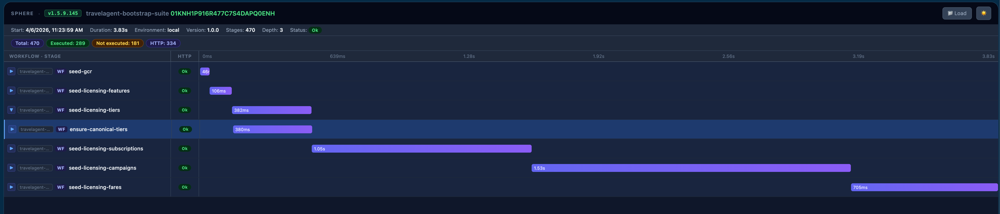
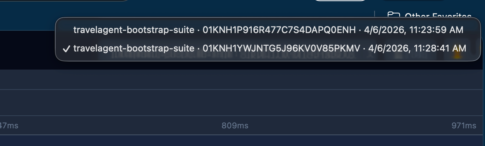
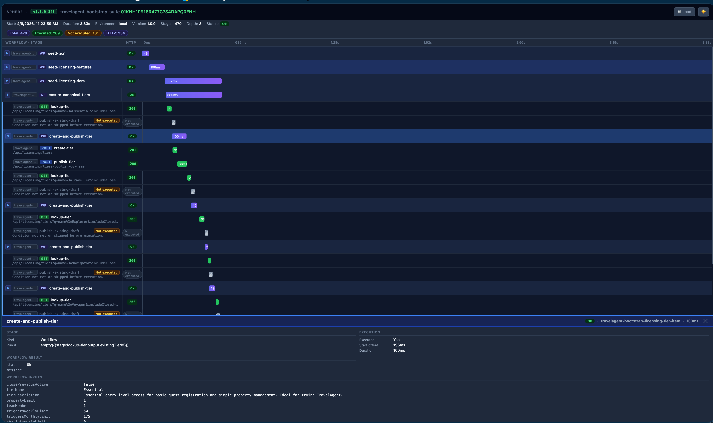

<p align="center">
  <a href="https://github.com/PinedaTec-EU/SphereIntegrationHub">
    
  </a>
</p>

[](https://deepwiki.com/PinedaTec-EU/SphereIntegrationHub)
[](https://opensource.org/licenses/MIT)
[](https://dotnet.microsoft.com/en-us/download/dotnet/10.0)

[](https://www.nuget.org/packages/SphereIntegrationHub.Tool/)
[](https://www.nuget.org/packages/SphereIntegrationHub.Mcp.Tool/)
[](https://www.nuget.org/packages/SphereIntegrationHub.Tool/)
[](https://github.com/PinedaTec-EU/SphereIntegrationHub/releases)
[](https://github.com/PinedaTec-EU/SphereIntegrationHub/commits/main)
[](https://github.com/PinedaTec-EU/SphereIntegrationHub/issues)
[](https://github.com/PinedaTec-EU/SphereIntegrationHub/stargazers)
[](https://twitter.com/jmrpineda)
[](https://www.linkedin.com/in/jmrpineda)

<p align="center">
  
</p>

CLI tool to orchestrate API calls using versioned Swagger catalogs and YAML workflows. Workflows can reference other workflows, share context (like JWTs), validate endpoints against cached Swagger specs, and run in dry-run mode for validation.

Documentation:

- [`Overview`](.doc/overview.md)
- [`Why SphereIntegrationHub`](.doc/why-sih.md)
- [`workflow schema`](.doc/workflow-schema.md)
- [`swagger catalog`](.doc/swagger-catalog.md)
- [`cli help`](.doc/cli.md)
- [`variables and context`](.doc/variables.md)
- [`dry-run validation`](.doc/dry-run.md)
- [`execution reporting`](.doc/execution-reporting.md)
- [`open telemetry`](.doc/telemetry.md)
- [`MCP Server`](.doc/mcp-server.md) - AI-assisted workflow creation (37 tools, all levels)
- [`GitHub Action`](.doc/github-action.md) - run workflows from any CI/CD pipeline
- [`plugins`](.doc/plugins.md)

## Community

If you use SphereIntegrationHub in your company or project, we'd love to hear about it!

- Give us a ⭐ on GitHub — it helps the project grow
- Share your experience on [LinkedIn](https://www.linkedin.com/in/jmrpineda) mentioning **#SphereIntegrationHub** — we repost and feature use cases
- Drop us a line at [sih@pinedatec.eu](mailto:sih@pinedatec.eu) — tell us what you're automating, we'd love to feature it

## Installation

SphereIntegrationHub ships as a dotnet global tool. Install it once and use the `sih` command anywhere:

```bash
dotnet tool install -g SphereIntegrationHub.Tool
```

Or add it as a local tool to your repo (recommended for teams and CI):

```bash
dotnet new tool-manifest   # only if .config/dotnet-tools.json doesn't exist yet
dotnet tool install SphereIntegrationHub.Tool
dotnet tool restore        # teammates and CI run this to pick it up
```

### Nugets
[CLI](https://www.nuget.org/packages/SphereIntegrationHub.Tool/)
[MCP](https://www.nuget.org/packages/SphereIntegrationHub.Mcp.Tool/)

Verify the installation:

```bash
sih --version
```

> **Requires .NET 10 or later.**  
> For AI-assisted workflow authoring, also install the MCP server: `dotnet tool install -g SphereIntegrationHub.Mcp.Tool`

## Catalog

The API catalog is a fixed JSON file with versions and API definitions. Each definition provides its own environment base URLs and a relative swagger path. An optional `healthCheck` probes the API before swagger caching and workflow execution:

`src/resources/api-catalog.json`

Swagger definitions are cached per version in:

`src/resources/cache/{version}/{definition}.json`

When the CLI resolves default paths from a workflow location, it treats the nearest ancestor `workflows/` folder as shared root. That keeps `api-catalog.json` and `cache/` centralized even if workflows are organized in nested subfolders under `workflows/`.

## GitHub Action

The `run-sphere-workflow` composite action lets you install the SphereIntegrationHub CLI and execute a workflow from any GitHub Actions pipeline with a single step.

```yaml
- uses: PinedaTec-EU/SphereIntegrationHub/.github/actions/run-sphere-workflow@main
  with:
    workflow-path: ./workflows/create-account.workflow
    cli-args: --env prod --catalog ./api-catalog.json
```

The action always runs `dotnet tool restore` first (so other tools in your manifest are not affected) and then updates `SphereIntegrationHub.Tool` — to the latest version by default, or to the exact version you specify via `tool-version`.

**Pre-deploy smoke test:**

```yaml
- uses: PinedaTec-EU/SphereIntegrationHub/.github/actions/run-sphere-workflow@main
  with:
    workflow-path: ./workflows/smoke-test.workflow
    cli-args: --env prod --dry-run --verbose
```

**Pin to a fixed version for reproducible production pipelines:**

```yaml
- uses: PinedaTec-EU/SphereIntegrationHub/.github/actions/run-sphere-workflow@main
  with:
    workflow-path: ./workflows/onboard-customer.workflow
    tool-version: '1.5.12.149'
    cli-args: --env prod --catalog ./api-catalog.json --varsfile ./prod.wfvars
```

**Upload execution report as a CI artifact:**

```yaml
- uses: PinedaTec-EU/SphereIntegrationHub/.github/actions/run-sphere-workflow@main
  with:
    workflow-path: ./workflows/integration-test.workflow
    cli-args: --env pre --report-format both --capture-http bodies

- uses: actions/upload-artifact@v4
  if: always()
  with:
    name: sih-execution-report
    path: '*.workflow.report.*'
```

See [`.doc/github-action.md`](.doc/github-action.md) for the full reference and more examples.

## Workflow overview

SphereIntegrationHub workflows are plain YAML and are designed to stay readable even when orchestration gets complex.

- Reference APIs from the versioned catalog and compose parent/child workflows.
- Accept typed inputs, `.wfvars`, and `.env` values.
- Mix endpoint calls, workflow stages, retries, circuit breakers, delays, and conditional branches.
- Work with structured JSON, file-backed payloads, `forEach`, and idempotent `ensure` flows.
- Emit JSON and HTML execution reports for post-run diagnosis.

See [`.doc/workflow-schema.md`](.doc/workflow-schema.md) for the full schema, [`.doc/variables.md`](.doc/variables.md) for variable resolution, and [`.doc/execution-reporting.md`](.doc/execution-reporting.md) for report artifacts and viewer behavior.

## Token and Workflow Semantics

Agents generating workflows should assume these runtime rules:

- `{{response.status}}`, `{{response.body}}`, and `{{response.headers.HeaderName}}` are supported for endpoint stages.
- `{{response.body.some.path}}` and `{{response.some.path}}` are valid when the response body is JSON.
- Optional path segments use a `?` suffix on the segment itself, for example `{{response.body.account.status?}}` or `{{stage:create.output.items.0.id?}}`. Missing optional segments resolve to empty output instead of failing.
- `runIf` supports compound expressions with `&&`, `||`, `!`, parentheses, safe comparisons against missing tokens, and helpers such as `exists(...)`, `empty(...)`, `coalesce(...)`, `first(...)`, `any(...)`, `jsonLength(...)`, and `isEmptyJson(...)`.
- Workflow validation can check response token paths against endpoint mock payloads when `stage.mock.payload` or `stage.mock.payloadFile` is present.
- `kind: Workflow` stage failures propagate to the parent workflow; parent execution does not continue past a failed child workflow.
- `forEach` on workflow stages aggregates both outputs and result state. In addition to `foreach_count` and `foreach_items`, workflow stages expose `foreach_results`, `foreach_success_count`, and `foreach_failed_count`.
- `response.*` tokens are endpoint-stage only. Workflow stages should use `stage:<name>.workflow.output.*` and `stage:<name>.workflow.result.{status,message}` instead.

## Execution reporting

SphereIntegrationHub can persist each run as JSON + HTML execution artifacts for diagnosis, auditability, and sharing. The HTML viewer gives you a timeline, per-stage drill-down, and multi-run switching from the same page.

- Machine-readable JSON report
- Self-contained HTML trace viewer
- Configurable HTTP capture with redaction by default

See [`.doc/execution-reporting.md`](.doc/execution-reporting.md) for full usage, artifact formats, and reporting configuration.

### Example report

Interactive timeline with nested workflows, stage duration, and skipped branches:



Execution switcher across multiple runs in the same output folder:



Stage drill-down with execution metadata and resolved workflow inputs/results:



### Example workflow (login)

```yaml
version: "3.10"
id: "01J7Z6J1KQZV8Y6J9G4E2ZB6QH"
name: "login"
description: "Login workflow that returns a JWT."
output: false
references:
  apis:
    - name: "example-service"
      definition: "example-service"
input:
  - name: "username"
    type: "Text"
    required: true
  - name: "password"
    type: "Text"
    required: true
stages:
  - name: "login"
    kind: "Endpoint"
    apiRef: "example-service"
    endpoint: "/api/auth/login"
    httpVerb: "POST"
    expectedStatus: 200
    headers:
      Content-Type: "application/json"
    body: |
      {
        "user": "{{input.username}}",
        "password": "{{input.password}}"
      }
    output:
      jwt: "{{response.jwt}}"
endStage:
  context:
    tokenId: "{{stage:login.output.jwt}}"
```

### Example workflow (idempotent bootstrap with files and foreach)

```yaml
version: "3.11"
id: "01JBOOTSTRAPEXAMPLE0000000001"
name: "bootstrap-accounts"
description: "Creates accounts idempotently from a seed file."
output: true
references:
  apis:
    - name: "accounts"
      definition: "accounts"
input:
  - name: "seed"
    type: "Array"
    required: true
stages:
  - name: "create-account"
    kind: "Endpoint"
    apiRef: "accounts"
    endpoint: "/api/accounts"
    httpVerb: "POST"
    expectedStatus: 201
    forEach: "{{input.seed}}"
    itemName: "item"
    bodyFile: "./payloads/create-account.json"
    ensure:
      mode: "CreateIfMissing"
      jumpTo: "load-existing"
      output:
        exists: "true"
  - name: "load-existing"
    kind: "Endpoint"
    apiRef: "accounts"
    endpoint: "/api/accounts/{{context:item.id}}"
    httpVerb: "GET"
    expectedStatus: 200
endStage:
  output:
    created: "{{stage:create-account.output.foreach_items}}"
```

Example `./payloads/create-account.json`:

```json
{
  "id": "{{context:item.id}}",
  "name": "{{context:item.name}}"
}
```

## Sample Workflows

The repository includes reference workflows under `samples/`:

- `sample-parent.workflow` and `sample-child.workflow`: parent/child composition, workflow outputs/results, retries, circuit breakers, and conditional follow-up stages.
- `sample-conditional.workflow`: compound `runIf` with `&&`, `||`, parentheses, safe missing-token checks, optional JSON paths, `empty(...)`, and `coalesce(...)`.
- `sample-bootstrap.workflow`: `expectedStatuses`, `onStatus`, `ensure`, `bodyFile`, `dataFile`, and `forEach` for seed/bootstrap scenarios.
- `sample-parent.wfvars`: companion input example for the parent/child sample.
- `payloads/bootstrap-account.json` and `seed/accounts.json`: file-backed request and collection samples used by `sample-bootstrap.workflow`.
- `api-catalog.json`: reference catalog for the sample workflows — defines the `accounts` API with per-environment base URLs and a relative swagger path.

Use these files directly when authoring new workflows or when prompting MCP-based generation.

## Usage

Dry-run (validates workflow, references, and swagger paths without calling endpoints):

```bash
sih \
  --workflow ./src/resources/workflows/create-account.workflow \
  --env pre \
  --dry-run \
  --verbose
```

Run with mocks (uses `stage.mock` when defined):

```bash
sih \
  --workflow ./src/resources/workflows/create-account.workflow \
  --env pre \
  --mocked
```

Override root `.env` for `{{env:NAME}}` tokens:

```bash
sih \
  --workflow ./src/resources/workflows/create-account.workflow \
  --env pre \
  --envfile ./workflows/.env
```

Force refresh of swagger cache:

```bash
sih \
  --workflow ./src/resources/workflows/create-account.workflow \
  --env pre \
  --refresh-cache
```

Execute a workflow:

```bash
sih \
  --workflow ./src/resources/workflows/create-account.workflow \
  --env pre \
  --input username=user \
  --input password=secret \
  --input accountName=Acme
```

Generate full execution artifacts:

```bash
sih \
  --workflow ./src/resources/workflows/create-account.workflow \
  --env pre \
  --report-format both \
  --capture-http bodies
```

This writes:

- `{name}.{executionId}.workflow.output`
- `{name}.{executionId}.workflow.report.json`
- `{name}.{executionId}.workflow.report.html`

Execution artifacts are written to the sibling `output/` directory next to the executed workflow file.

Reports include stage timings, retries, jumps, ensure status, HTTP status, redacted headers/body capture, and final outputs.

Override root `.env` for `{{env:NAME}}` tokens:

```bash
sih \
  --workflow ./src/resources/workflows/create-account.workflow \
  --env pre \
  --envfile ./workflows/.env
```

### Key Advantages of SphereIntegrationHub

#### 🎯 1. Modular Workflow Composition

Unlike Postman's monolithic collections, workflows can reference other workflows as reusable modules:

```yaml
references:
  workflows:
    - name: "login"
      path: "./login.workflow"
stages:
  - name: "authenticate"
    kind: "Workflow"
    workflowRef: "login"  # Reuse login workflow
```

#### 🛡️ 2. Contract-First Validation

Validate endpoints against cached Swagger specifications **before execution**:

```bash
--dry-run --verbose  # Validates without making HTTP calls
```

This catches endpoint mismatches, missing parameters, and schema violations at validation time, not runtime.

#### 📦 3. GitOps-Ready Workflows

YAML workflows are human-readable and Git-friendly. Pull requests show exact changes:

```diff
+ - name: "create-org"
+   kind: "Endpoint"
+   apiRef: "accounts"
+   endpoint: "/api/organizations"
```

Compare this to Postman's JSON exports with GUIDs and nested structures.

#### 🔄 4. Context Propagation

Seamlessly pass JWTs, IDs, and data between workflow stages and nested workflows:

```yaml
endStage:
  context:
    tokenId: "{{stage:login.output.jwt}}"
    orgId: "{{stage:create-org.output.id}}"
```

No scripting required—context flows declaratively.

#### 🎲 5. Dynamic Value Service

Generate random values with built-in formatting:

```yaml
variables:
  - name: "accountId"
    type: "Random"
    randomType: "Guid"
  - name: "timestamp"
    type: "Random"
    randomType: "DateTime"
```

#### 🔍 6. Multi-Version API Catalog

Manage multiple API versions and environments in a single catalog:

```json
{
  "version": "3.11",
  "definitions": [
    {
      "name": "example-service",
      "swaggerUrl": "/example/swagger/v1.0/swagger.json",
      "basePath": "/ocapi",
      "baseUrl": {
        "dev": "https://dev.api.com",
        "pre": "https://pre.api.com",
        "prod": "https://api.com"
      }
    }
  ]
}
```

Swagger definitions are cached per version, ensuring validation against the correct contract.

#### 🚀 7. CI/CD Native

No conversion needed—workflows execute directly in pipelines:

```bash
sih \
  --workflow ./workflows/smoke-test.workflow \
  --env prod \
  --dry-run  # Gate deployments with validation
```

#### 💾 8. Offline-First & Cloud-Free

No account required. No cloud dependency. No internet connection needed for execution:

- **All-in-one-place**: Workflows, catalogs, and Swagger cache live on disk
- **No vendor lock-in**: No subscription, no API limits
- **Optional telemetry**: OpenTelemetry is supported but disabled by default
- **Edit anywhere**: YAML files editable with any text editor (VS Code, vim, nano)
- **Complete privacy**: Your API workflows never leave your infrastructure
- **Zero latency**: No cloud round-trips—everything runs locally

Unlike Postman (cloud sync required) or Apidog (account-based), SphereIntegrationHub shares Bruno's philosophy of local-first tooling, but adds enterprise orchestration capabilities.

### When to Use Each Tool

**Use Postman/Apidog/Bruno for:**

- Interactive API exploration and debugging
- Collaborative documentation with teams
- Manual testing during development
- Learning new APIs

**Use SphereIntegrationHub for:**

- Complex multi-step orchestration (10+ sequential calls)
- Automated integration testing in CI/CD
- Reproducible API workflows in Git
- Contract validation against versioned Swagger specs
- Production smoke tests and health checks
- Scenarios requiring workflow composition and reuse

### Roadmap

### Current Position

SphereIntegrationHub is now strong as a local-first API orchestration runtime and AI-assisted workflow authoring tool.

- ✅ Contract-aware endpoint execution with versioned Swagger validation
- ✅ Workflow composition and reusable child workflows
- ✅ Child workflow failures propagate to the parent workflow
- ✅ Idempotent HTTP branching with `expectedStatuses`, `onStatus`, `jumpOnStatus`, and `ensure`
- ✅ JSON-aware expressions and structured `Object` / `Array` inputs
- ✅ Response token validation against endpoint mock payloads during workflow validation
- ✅ Optional path segments with `?` for sparse JSON payloads
- ✅ `bodyFile`, `dataFile`, and `forEach` for large payloads and collection bootstraps
- ✅ Aggregated `forEach` workflow result state via `foreach_results`, `foreach_success_count`, and `foreach_failed_count`
- ✅ Post-execution observability with JSON/HTML reports, stage timelines, and summary output
- ✅ Interactive HTML trace report (`sih report`) — Jaeger-style timeline with per-stage drill-down, HTTP details, and file picker to load prior executions; generated as a standalone command from any `.workflow.report.json` artifact
- ✅ MCP server with 37 tools across all capability levels — catalog exploration, workflow validation, stage generation, variable analysis, semantic dependency inference, pattern detection, full system synthesis, and optimization — fully aligned with the runtime schema and ready for production AI-assisted authoring
- ✅ GitHub Action (`run-sphere-workflow`) for executing workflows from any CI/CD pipeline, with optional version pinning

### Near-Term Priorities

1. **Assertions and Regression Diagnostics**
   First-class assertions, golden snapshots, and failure diffs on top of the new execution reports.
2. **Snapshot and Regression Testing**
   Snapshot authoring helpers and update workflows for intentional baseline changes.
3. **Secret Manager Integration**
   AWS Secrets Manager, Azure Key Vault, HashiCorp Vault, and similar providers.
4. **Plugin/Transformer Extensibility**
   Load custom .NET transformations and stage extensions safely.

### Mid-Term Roadmap

1. **Full Web Dashboard**
   Optional persistent web interface with execution history across runs, search, filtering, and team-level diagnostics. The per-run interactive HTML trace report (`sih report`) covers local and CI diagnostics; this item targets a hosted, multi-run experience.
2. **Visual Workflow Editor**
   Web-based workflow builder for teams that want graphical authoring on top of the YAML runtime.
3. **Higher-Level Runtime Primitives**
   More semantic stage sugar beyond `ensure`, plus better assertions and reusable payload/template blocks.

### Ongoing Investment

1. **MCP Integration**
   Keep the MCP aligned with runtime capabilities so AI agents can generate valid workflows without inventing unsupported schema.
2. **Authoring Ergonomics**
   Improve generated examples, repair tools, diagnostics, and workflow scaffolding quality.
