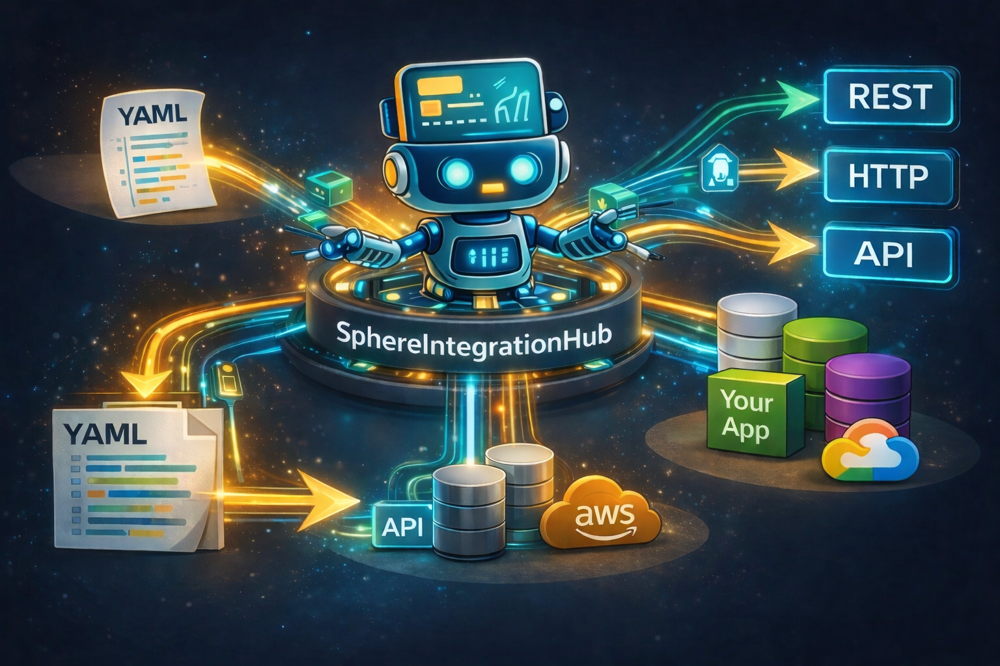
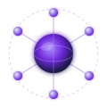

<p align="center">
  <a href="https://github.com/PinedaTec-EU/SphereIntegrationHub">
    
  </a>
</p>

[](https://deepwiki.com/PinedaTec-EU/SphereIntegrationHub)
[](https://opensource.org/licenses/MIT)
[](https://www.npmjs.com/package/@pinedatec.eu/sphere-integration-hub)
[](https://www.npmjs.com/package/@pinedatec.eu/sphere-integration-hub)

[](https://www.nuget.org/packages/SphereIntegrationHub.Tool/)
[](https://www.nuget.org/packages/SphereIntegrationHub.Mcp.Tool/)
[](https://github.com/PinedaTec-EU/SphereIntegrationHub/releases)
[](https://github.com/PinedaTec-EU/SphereIntegrationHub/commits/main)
[](https://github.com/PinedaTec-EU/SphereIntegrationHub/issues)
[](https://github.com/PinedaTec-EU/SphereIntegrationHub/stargazers)
[](https://twitter.com/jmrpineda)
[](https://www.linkedin.com/in/jmrpineda)

<p align="center">
  
</p>

# SphereIntegrationHub: API integration testing and reproducible API workflows for CI

SphereIntegrationHub (SIH) helps teams run **workflow-based API integration tests**, **OpenAPI contract validation pipelines**, and **reproducible API workflows** from Git-friendly YAML.

Use it when Postman/Newman collections, Bruno exports, custom scripts, or ad hoc CI jobs start drifting away from the API contracts they are supposed to validate.

SIH turns multi-step API scenarios into version-controlled workflows that can be dry-run validated against OpenAPI catalogs, executed locally or in CI/CD, and reviewed through JSON and HTML execution reports.

## What problem does SIH solve?

Multi-step API flows usually fail for boring reasons:

- The smoke test in CI uses one environment while the API contract changed in another.
- A Postman or Bruno collection works locally but the exported artifact is hard to review in Git.
- Custom Python, Bash, or JavaScript scripts grow into unmaintained test infrastructure.
- A workflow calls several endpoints, but nobody validates the endpoint references before runtime.
- Failures leave logs, but not a reusable execution trace that explains the full API scenario.

SIH is built for teams that need **API integration testing in CI**, **contract-aware API smoke tests**, **reproducible API workflow automation**, and **GitOps-friendly API test assets**.

## Why SIH?

- **Workflow-based API testing**: model real API scenarios as YAML stages, including parent-child workflows.
- **OpenAPI-aware validation**: dry-run workflows against versioned API catalogs before live execution.
- **CI/CD native**: run the same workflow from a laptop, GitHub Actions, or any pipeline that can execute a CLI.
- **Git-friendly artifacts**: review YAML workflow changes instead of opaque GUI exports or one-off scripts.
- **Reproducible reports**: generate machine-readable JSON and self-contained HTML traces for each execution.
- **Regression baselines**: create snapshot JSON from known-good runs and compare later executions visually or from the CLI.
- **Assertion diagnostics**: record stage/end-stage assertions, blocking behavior, and pass/fail state in JSON and HTML reports.
- **Offline-first execution**: use local workflow, catalog, and contract cache files without a hosted control plane.

The runtime stays focused on API workflow orchestration. Protocol and channel behavior is delivered through plugins such as HTTP, OpenAI LLM, and secret providers like Vaultwarden.

## Start here

- [`Documentation hub`](.doc/index.md)
- [`Getting started`](.doc/getting-started.md)
- [`Workflow runtime semantics`](.doc/runtime-semantics.md)
- [`Workflow schema`](.doc/workflow-schema.md)
- [`MCP authoring quick reference`](.doc/mcp-authoring-quick-reference.md)
- [`MCP Server`](.doc/mcp-server.md)
- [`SDK language hosts`](.doc/sdk-language-hosts.md)
- [`Plugins`](.doc/plugins.md)

## Common use cases

- API integration testing in CI/CD
- API contract validation pipelines
- Reproducible API smoke tests
- Git-friendly replacement for fragile API automation scripts
- Multi-step API workflow execution across environments
- Environment bootstrap flows and regression API scenarios
- AI-assisted API workflow authoring through the SIH MCP server

## Quick install

### npm / npx

```bash
npm install -g @pinedatec.eu/sphere-integration-hub
sih --version
```

```bash
npx @pinedatec.eu/sphere-integration-hub
```

### dotnet tool

```bash
dotnet tool install -g SphereIntegrationHub.Tool
dotnet tool install -g SphereIntegrationHub.Mcp.Tool
```

NuGet packages: [CLI](https://www.nuget.org/packages/SphereIntegrationHub.Tool/) · [MCP](https://www.nuget.org/packages/SphereIntegrationHub.Mcp.Tool/)

## Release integrity

When publishing the npm package, the npm semver and the GitHub release tag are intentionally not identical:

- npm publishes `major.minor.patch`
- GitHub releases publish `major.minor.patch.build`
- `npm/sphere-integration-hub/package.json` must persist that four-part release as `sihReleaseVersion`

Release publication is only valid when all three checks pass:

- the GitHub release tag `v<sihReleaseVersion>` exists before `npm publish`
- the published npm package contains `sihReleaseVersion` with that exact four-part value
- the npm postinstall regression test passes before publication

The canonical release path is `./scripts/release.sh`, which enforces these checks before publishing npm.

## First run

Validate a workflow without calling endpoints:

```bash
sih \
  --workflow ./src/resources/workflows/create-account.workflow \
  --env pre \
  --dry-run \
  --verbose
```

Execute it with inputs:

```bash
sih \
  --workflow ./src/resources/workflows/create-account.workflow \
  --env pre \
  --input username=user \
  --input password=secret \
  --input accountName=Acme
```

Generate JSON + HTML execution artifacts:

```bash
sih \
  --workflow ./src/resources/workflows/create-account.workflow \
  --env pre \
  --report-format both \
  --capture-http bodies
```

Create and compare a regression snapshot:

```bash
sih snapshot create ./output/create-account.01J....workflow.report.json --name happy-path
sih snapshot compare ./output/create-account.01K....workflow.report.json \
  --snapshot ./snapshots/create-account.happy-path.workflow.snapshot.json
```

See [`getting-started.md`](.doc/getting-started.md) for install modes, CLI usage, GitHub Action usage, and SDK direction.

The planned language SDK contracts are documented in [`.doc/sdk-language-hosts.md`](.doc/sdk-language-hosts.md).

## When to use SIH instead of other tools

Use Postman, Apidog, or Bruno for interactive API exploration, manual debugging, and team-facing API documentation.

Use SphereIntegrationHub when the same API scenario must become a repeatable pipeline asset: stored in Git, reviewed as YAML, validated against OpenAPI, executed by a CLI, and reported consistently.

Use custom scripts when you need full programming control. Use SIH when the workflow itself should be the maintained artifact and the runtime should provide validation, context propagation, reporting, and reusable workflow composition.

## Core concepts

- Workflows are plain YAML and remain the single source of truth for orchestration.
- API contracts live in versioned `api.catalog` definitions with cached OpenAPI documents.
- Validation can inspect workflows, references, and contract compatibility before runtime.
- Workflow stages can call endpoints, invoke child workflows, iterate collections, and expose outputs back to parent flows.
- Assertions can validate stage outputs and final workflow outputs, with blocking or non-blocking failure behavior.
- Execution reports persist machine-readable JSON plus a self-contained HTML trace viewer with baseline comparison, assertions, compact metrics, and a workflow graph.
- Snapshot baselines (`*.workflow.snapshot.json`) provide stable regression references that can be loaded automatically from output folders, `snapshots/`, explicit paths, or `api.catalog` `baselineSnapshot`.

## Examples

- [`samples/sample-bootstrap.workflow`](samples/sample-bootstrap.workflow): explicit `Http` plugin stage with plugin-specific `config`.
- [`samples/openai-llm/sample-openai-llm.workflow`](samples/openai-llm/sample-openai-llm.workflow): OpenAI plugin with `kind: LLM`, structured output, limits, timeout, and token usage.
- [`samples/workflows.config`](samples/workflows.config): explicit plugin activation and reporting defaults.
- [`samples/api.catalog`](samples/api.catalog): catalog definition with plugin binding.
- [`samples/vaultwarden-secrets`](samples/vaultwarden-secrets): Vaultwarden secret provider feeding `{{env:...}}` tokens.

More examples and usage patterns live in [`getting-started.md`](.doc/getting-started.md) and the sample files under [`samples/`](samples).

## Documentation map

### Product and adoption

- [`Overview`](.doc/overview.md)
- [`Why SphereIntegrationHub`](.doc/why-sih.md)
- [`Positioning and roadmap`](.doc/positioning-and-roadmap.md)
- [`Documentation hub`](.doc/index.md)

### Authoring and execution

- [`Getting started`](.doc/getting-started.md)
- [`Workflow schema`](.doc/workflow-schema.md)
- [`Variables and context`](.doc/variables.md)
- [`Dry-run validation`](.doc/dry-run.md)
- [`Workflow runtime semantics`](.doc/runtime-semantics.md)
- [`Execution reporting`](.doc/execution-reporting.md)
- [`Conditional expressions`](.doc/conditional-expressions.md)
- [`OpenAPI catalog`](.doc/swagger-catalog.md)
- [`SDK language hosts`](.doc/sdk-language-hosts.md)
- [`MCP authoring quick reference`](.doc/mcp-authoring-quick-reference.md)

### Integrations

- [`MCP Server`](.doc/mcp-server.md)
- [`GitHub Action`](.doc/github-action.md)
- [`Plugins`](.doc/plugins.md)
- [`HTTP plugin`](.doc/plugins-http.md)
- [`OpenAI LLM plugin`](.doc/plugins-openai.md)
- [`Secret providers`](.doc/secret-providers.md)
- [`Vaultwarden secret provider`](.doc/plugins-vaultwarden.md)
- [`OpenTelemetry`](.doc/telemetry.md)

## Community

If you use SphereIntegrationHub in your company or project, we would like to hear about it.

- Give the repository a star on GitHub.
- Share your use case on [LinkedIn](https://www.linkedin.com/in/jmrpineda) with `#SphereIntegrationHub`.
- Contact [sih@pinedatec.eu](mailto:sih@pinedatec.eu).
